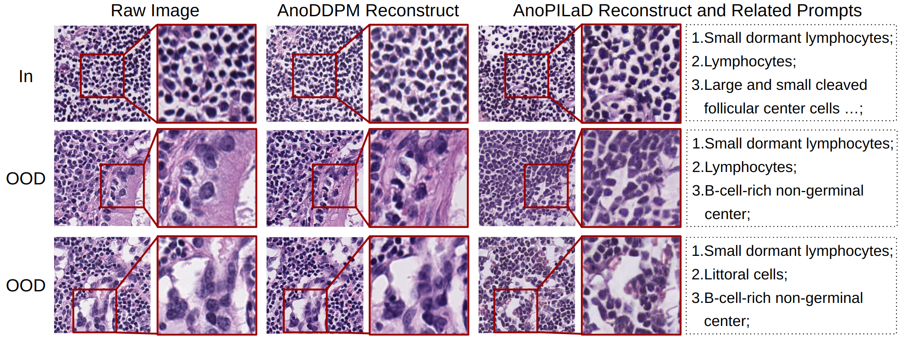

# AnoPILaD
 Pathology-Informed Latent Diffusion model for anomaly detection in lymph node pathology images.

[//]: # (![Alt Text]&#40;image_examples/main.png&#41;)



## Setup
```angular2html
conda create -n anopilad python=3.11
conda activate anopilad
pip install --upgrade pip
pip install -r requirements.txt
pip install git+https://github.com/Mahmoodlab/CONCH.git
```

## Image Captioning
```angular2html
CUDA_VISIBLE_DEVICES=0 image_caption.py --data_root_path "" --batch_size 64
```

## Training
```angular2html
CUDA_VISIBLE_DEVICES=0,1 OMP_NUM_THREADS=2  python -m torch.distributed.run --nproc_per_node=2 train_text_to_image_lora.py --train_data_dir "" 
--train_batch_size 16 
--num_train_epochs 20
--train_data_dir "/data1/jiamu/Lymphnode/256_20_v3/train_tmp"
--output_dir "./pretrained_weights/sd-model-finetuned-lora"
--validation_prompt [
            'a histopathological photograph of (plasma cell-rich Germinal center)- and (lymphocytes) and (follicular dendritic cells)++',
            'a histopathological photograph of (small dormant lymphocytes)++ and (lymphocytes)++ and (B-cell-rich non-germinal center) and (mantle zone) and (large B lymphocytes)',
            'a histopathological photograph of secondary lymphoid follicles',
            'a histopathological photograph of (mantle zone)+ and (small dormant lymphocytes) and (germinal center) and (lymphocytes) and (follicular dendritic cells)'
        ]
--validation_batch_size 4
```

## Acknowledgements
This project uses training code "train_Text_to_image_lora.py" modified from [Original Repository](https://github.com/huggingface/diffusers/blob/main/examples/text_to_image/train_text_to_image_lora.py).  
and "ldm_solvers.py" modified from [Original Repository](https://github.com/CFGpp-diffusion/CFGpp/blob/main/latent_diffusion.py)
Credit to the original authors for their contributions.
