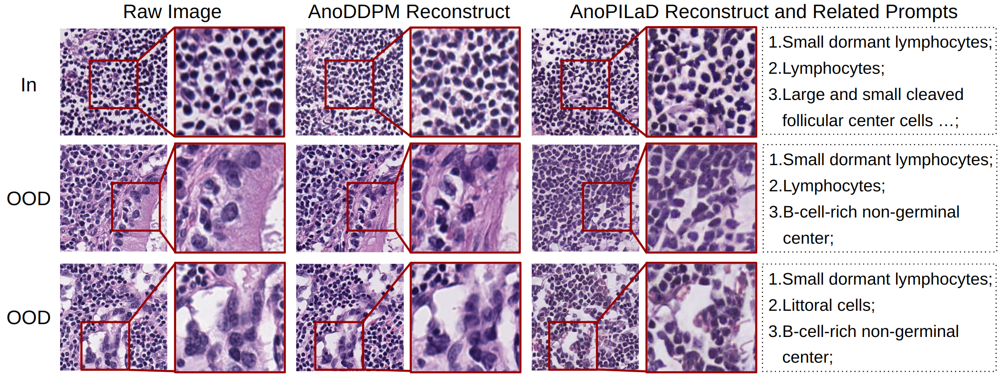

# AnoPILaD
 Pathology-Informed Latent Diffusion model for anomaly detection in lymph node pathology images.

[//]: # (![Alt Text]&#40;image_examples/main.png&#41;)



## Setup
```angular2html
conda create -n anopilad python=3.11
conda activate anopilad
pip install --upgrade pip
pip install -r requirements.txt
pip install git+https://github.com/Mahmoodlab/CONCH.git
```

## Data Preparation
We assume that you have 4 'YOUR_DATA_DIR' for training, validation, test_ID, and test_OOD 
(YOUR_TRAIN_DIR, YOUR_VAL_DIR, YOUR_TEST_ID_DIR, YOUR_TEST_OOD_DIR). In each 'YOUR_DATA_DIR', there is a 'metadata.csv' contains the information of image paths and prompts. 
Please make the directory as the following structure and get 'metadata.csv' by doing the next 'Image Captioning' step.
```
YOUR_DATA_DIR
├── metadata.csv
├── slide0
│   ├── patch0.png
│   ├── patch1.png
│   ├── ...
├── slide1
│   ├── patch0.png
│   ├── patch1.png
│   ├── ...
├── ...
```

## Image Captioning
```angular2html
CUDA_VISIBLE_DEVICES=0 python image_caption.py --data_root_path "YOUR_DATA_DIR" --batch_size 64
```


## Training
```angular2html
CUDA_VISIBLE_DEVICES=0,1 OMP_NUM_THREADS=2  python -m torch.distributed.run --nproc_per_node=2 train_text_to_image_lora.py --train_batch_size 16 --num_train_epochs 20 --train_data_dir "YOUR_TRAIN_DATA_DIR" --output_dir "./pretrained_weights/sd-model-finetuned-lora/" --validation_prompt ['prompt0', 'prompt1',] --num_validation_images 4
```

## Recontruction using the trained model
```angular2html
CUDA_VISIBLE_DEVICES=0,1 OMP_NUM_THREADS=2  python -m torch.distributed.run --nproc_per_node=2 rec_generate.py 
```

## Acknowledgements
This project uses training code "train_Text_to_image_lora.py" modified from [Original Repository](https://github.com/huggingface/diffusers/blob/main/examples/text_to_image/train_text_to_image_lora.py).  
and "ldm_solvers.py" modified from [Original Repository](https://github.com/CFGpp-diffusion/CFGpp/blob/main/latent_diffusion.py)
Credit to the original authors for their contributions.
